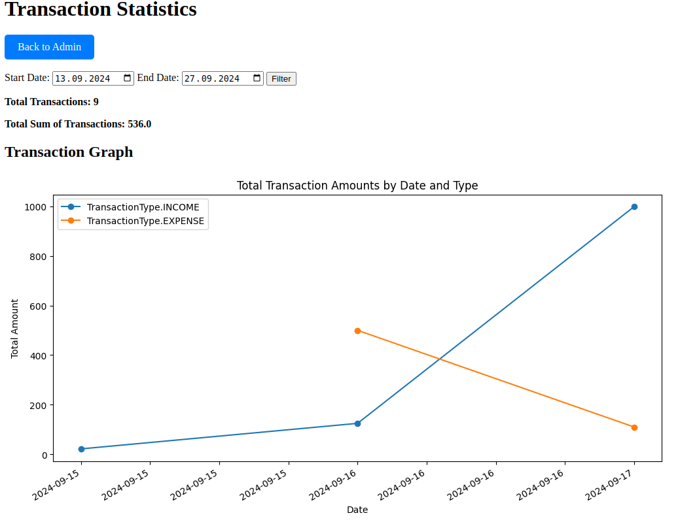

# The EasyLife test task

*To start the project you need to execute:**

* clone project repo
* Create an .env file and populate it following the default.env file example

* execute the command `make build`
* execute the command `make cmd`
* execute the command `make run`

You can fill db or run `make load` for load dump (**when container is running**)

you can check swagger on http://0.0.0.0:8080/docs

you can check db: GET http://0.0.0.0:8080/health

you can create user on route: POST http://0.0.0.0:8080/users/sign-up

DB dump contains data on 2 users and several transactions

You can: 

* create user on route: POST http://0.0.0.0:8080/users/sign-up
* get user on route: GET http://0.0.0.0:8080/users/{pk}
* get users on route: GET http://0.0.0.0:8080/users/
* create transaction on route: POST http://0.0.0.0:8080/transactions/

Admin panel:
* check admin on route http://0.0.0.0:8080/admin/ 

You can read, update,delete users and transactions

You can check statistic on http://0.0.0.0:8080/admin/statistic (or push *Statistic Page* button in toolbar)

Statistic have graphic and date filter, where *total sum = income sum - expense sum*

